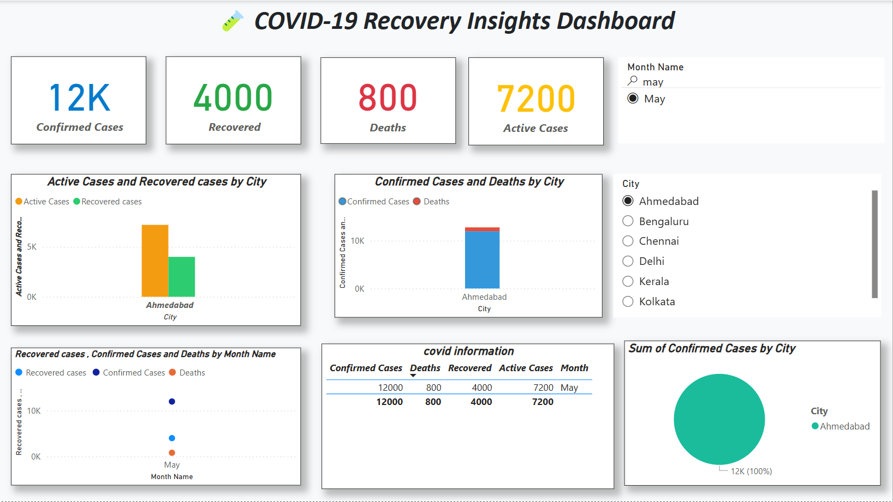

🦠 COVID-19 Recovery Insights Dashboard
This Power BI dashboard provides a visual analysis of COVID-19 cases across different cities in India for the month of May. It highlights the number of confirmed cases, recoveries, deaths, and active cases, giving users a clear understanding of the pandemic's status in a specific region.

📊 Dashboard Preview

📁 Project Overview
Tool Used: Power BI

Focus Area: COVID-19 Case Analysis by City and Month

Month Filtered: May

Selected City: Ahmedabad (default selection)

✅ Key Metrics Displayed
Total Confirmed Cases: 12,000

Total Recovered Cases: 4,000

Total Deaths: 800

Total Active Cases: 7,200

📌 Visuals Included
KPI Cards for Confirmed, Recovered, Deaths, and Active Cases

Bar Charts:

Active vs. Recovered Cases by City

Confirmed vs. Deaths by City

Line/Clustered Column Chart: Trends by Month

Pie Chart: Distribution of Confirmed Cases by City

Table: Detailed COVID Information

📂 Dataset Columns
City

Month

Confirmed Cases

Recovered

Deaths

Active Cases (calculated as Confirmed - Recovered - Deaths)

🎯 Insights
Ahmedabad had 12,000 confirmed cases in May with 4,000 recoveries and 800 deaths.

The dashboard allows filtering by city and month for dynamic analysis.

Pie chart confirms Ahmedabad is currently the only city with reported data in the filtered view.
